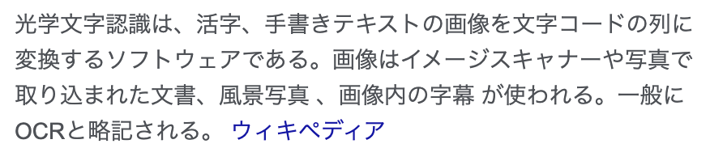
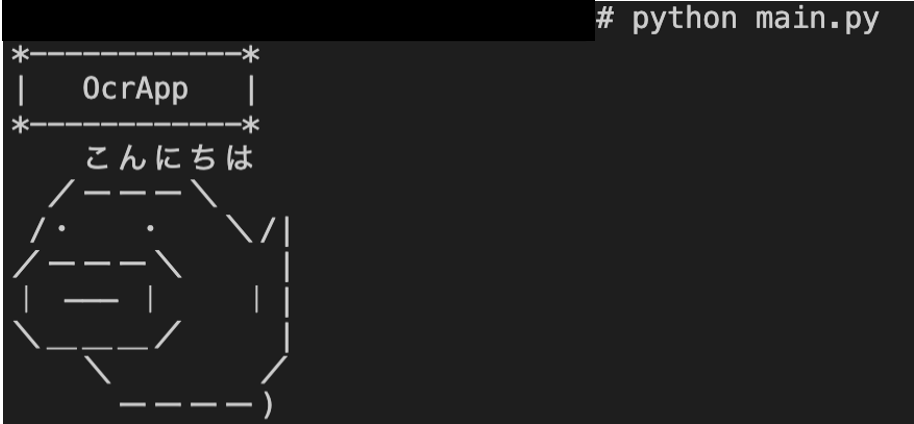
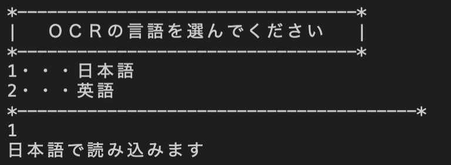
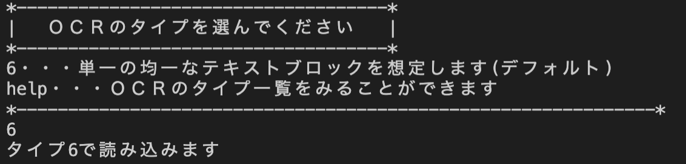
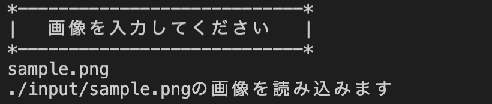
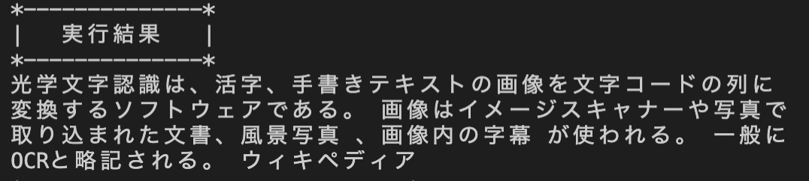
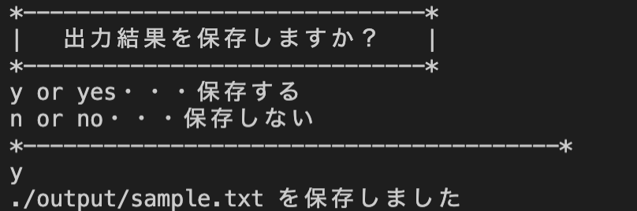

# シンプルなOCRアプリ
## 環境
- Docker 20.10.0
- Python 3.9.1
- Pillow     8.1.0
- pyocr      0.8
- tesseract 4.0.0
  
```docker:dockerのビルド
docker build -t [コンテナ名] [Dockerfileがあるパス]
```
<!-- ```docker:ローカルフォルダとのマウント
docker run -v [ローカルパス]:/usr/share/host --name [コンテナ名] -it [イメージ名] /bin/bash
``` 
マウントがうまくいかなかった
pythonイメージでマウントするとうまくいったので、pythonイメージからDockerfile通りにインストールした
-->

### 参考
- [tesseract+pytesseractのdockerコンテナ](https://qiita.com/cranpun/items/704a32f0def141ea1da4)

## 使用例
入力画像


出力結果
```txt:sample.txt
光学文字認識は、活字、手書きテキストの画像を文字コードの列に
変換するソフトウェアである。 画像はイメージスキャナーや写真で
取り込まれた文書、風景写真 、画像内の字幕 が使われる。 一般に
OCRと略記される。 ウィキペディア
```


## 使い方
1. inputフォルダにOCRをかけたい画像を保存しておき、次のコマンドを実行する。
```Python:OcrAppの実行
python main.py
```

そうすると、以下の画面が表示される。


2. 以下の画面で言語を選択する。


3. 言語を選択したら、OCRのタイプを選択する。

OCRのタイプの一覧は以下のようになります。
- 0・・・方向とスクリプト検出(OSD)のみ
- 1・・・OSDによる自動ページセグメンテーション
- 2・・・自動ページセグメンテーション。OSDまたはOCRなし
- 3・・・完全自動のページセグメンテーション。OSDなし
- 4・・・可変サイズのテキストの単一列を想定します
- 5・・・垂直に配置されたテキストの単一の均一なブロックを想定します
- 6・・・単一の均一なテキストブロックを想定します
- 7・・・画像を単一のテキスト行として扱います
- 8・・・画像を1つの単語として扱います
- 9・・・画像を円の中の1つの単語として扱います
- 10・・・画像を単一の文字として扱います

3. 以下の画面で入力する画像を選択する。(パスじゃなくていい)

入力画像が読み込まれたら、OCRの実行結果が表示されます。

4. 以下の画面で実行結果を保存するかどうかを選択する。


以上です。

## 今後の展望
- 画像の前処理のプログラムも追加する
- 使用したOCRモデルを用途によって再学習させる